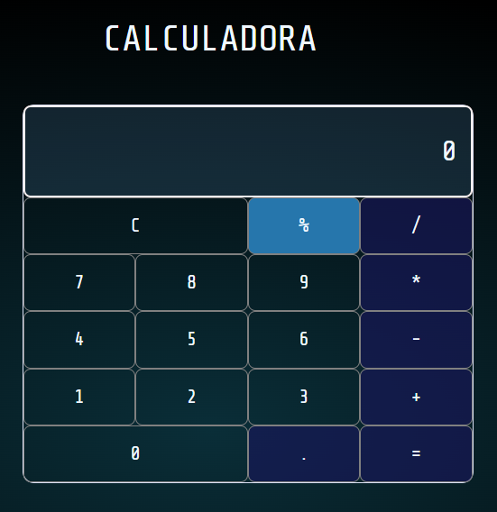

## CALCULADORA 

### INTEGRANTES

- Joaquin Baeza: https://github.com/Joaquin-B-S
- Cintia Muñoz: https://github.com/Cintia-MV
- Oscar Fernandez: https://github.com/cokardox 
- Hans Schiess: https://github.com/schiesscl

### INDICACIONES

Para utilizar la calculadora, haga clic en los botones numéricos y operadores en el orden deseado para construir la operación. 
El resultado se mostrará en la pantalla en tiempo real a medida que se ingresan los valores y se presionan los botones. 
Para borrar la pantalla, haga clic en el botón "C".
Para obtener el resultado final, haga clic en el botón "=" y el resultado se mostrará en la pantalla.

Para obtener el porcentaje, primero ingrese el número al que desea calcular el porcentaje y luego presione el botón "%". 
A continuación, ingrese el porcentaje que desea calcular y presione el botón "=" para obtener el resultado.
Por ejemplo, si desea calcular el 20% de 50, primero ingrese 50, luego presione el botón "%" y luego ingrese 20 y presione el botón "=" para obtener el resultado de 10.

### FUNCIONES

#### Funcion Calcular

La función obtiene la propiedad innerHTML del elemento display, la cual representa el contenido de texto del elemento, y la pasa como argumento a la función eval(). La función eval() devuelve el valor resultante. Dentro de esta función encontramos un "if" para poder 
obtener el porcentaje y que javascript no considere el simbolo de porcentaje cómo módulo.

                        function calcular(display) {
                            if (display.innerHTML.includes("%")) { 
                                const textoSeparado = display.textContent.split("%"); 
                                const resultado = calcularPorcentaje(textoSeparado[0], textoSeparado[1]); 
                                display.innerHTML = resultado; 
                            } else {
                                display.innerHTML = eval(display.innerHTML);
                            }
                        }
                
#### Funcion Actualizar

Esta función  toma dos argumentos, display y botones, primero verifica si el innerHTML actual del display es igual a 0. Si es así, se borra el contenido actual.
Luego, la función agrega el contenido del botón presionado al innerHTML del display. 
 
 
                        function actualizar(display, botones) {
                            if (display.innerHTML == 0) {
                                display.innerHTML = '';
                            }
                            display.innerHTML += botones.innerHTML; 
                            display.innerHTML + boton.innerHTML */
                        }

#### Funcion Borrar

Esta función  se encarga de restablecer el contenido del display a 0, borrando todo el contenido anterior.

                        function borrar(display) {
                            display.innerHTML = 0;
                        }

#### Funcion Calcular Procentaje
                        
Esta función toma dos argumentos, el primer argumento es el número al que se le calculará el porcentaje y el segundo argumento es el porcentaje que se desea calcular.

                        function calcularPorcentaje(value, percent) {
                            return (value * percent) / 100;
                        }

### function calculadora

La función evalua 2 argumentos El primer argumento botones se refiere al botón que ha sido presionado por el usuario y el segundo argumento display es el elemento HTML que muestra el contenido actual la calculadora.
se utliza un switch para determinar la acción que se debe tomar según el botón que se haya presionado.
                
                1.	Si el botón presionado es 'C', entonces la función borrar se llama con el argumento display para restablecer el contenido del display a 0.
                
                1.	Si el botón presionado es '=', entonces la función calcular se llama con el argumento display para evaluar la expresión matemática que se muestra en el display.
                
                1.	Si el botón presionado no es ni 'C' ni '=', entonces la función actualizar se llama con los argumentos display y botones para actualizar el contenido del display con el botón presionado.

                        function calculadora(botones, display) {
                                switch (botones.innerHTML) {
                                    case 'C':
                                        borrar(display);
                                        break;

                                    case '=':
                                        calcular(display);
                                        break;

                                    default:
                                        actualizar(display, botones);
                                        break;
                                }
                            }

### Funcion addEventListener

se ejecuta cuando la página web se carga completamente en el navegador del usuario. La función addEventListener se utiliza para agregar un escuchador de eventos a la ventana del navegador. En este caso, el evento que se escucha es load, lo que significa que el código se ejecutará después de que todos los recursos de la página se hayan cargado.
Una vez que se ha cargado la página, el código utiliza el método querySelector para buscar un elemento con la clase .calculadora-display en el DOM de la página web y lo almacena en la constante display. El método querySelector devuelve solo el primer elemento que coincide con el selector especificado.
Luego, el código utiliza el método getElementsByClassName para buscar todos los elementos con la clase .keypad-botones en el DOM y los almacena en la variable keypadBotones. 

                            window.addEventListener('load', () => {
                                const display = document.querySelector('.calculadora-display');
                                const keypadBotones = document.getElementsByClassName('keypad-botones');

                            })
### array                                     

keypadBotonesArray            

Se crear un arreglo para capturar los botenes y se guarda en un constante keypadBotonesArray la cual posteriormente se se recorre con un foreach  y se le agrega el evento click

                        keypadBotonesArray.forEach((botones) => {
                                botones.addEventListener('click', () => {
                                    calculadora(botones, display)
                                })
                            })

